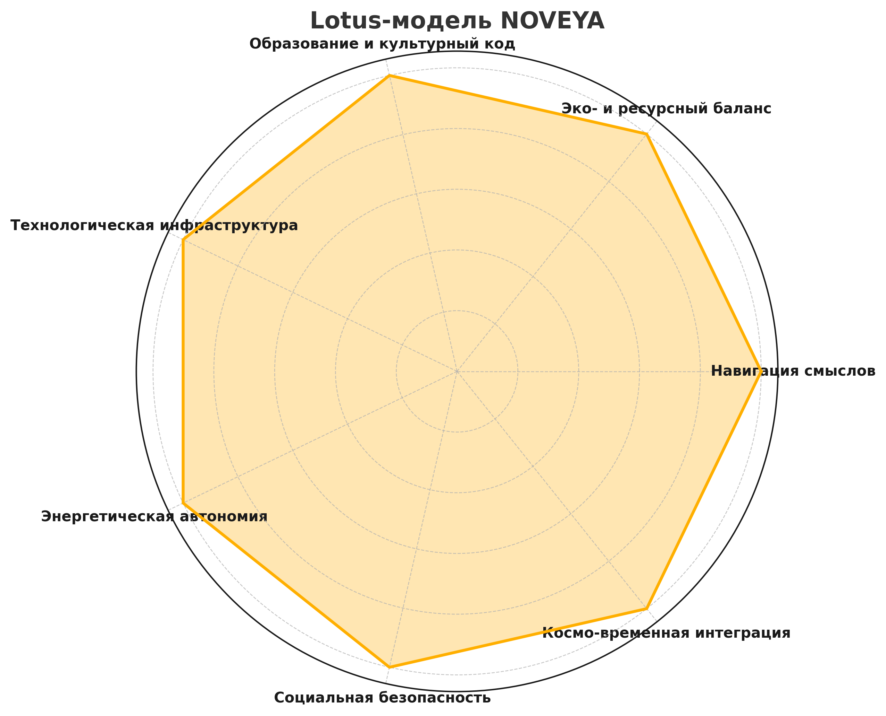

# 🌐 NOVEYA Meta-Platform

## 1. Маніфест
NOVEYA – це розподілена мета-платформа для самоорганізації, суверенної взаємодії та створення живих спільнот.
Ми об'єднуємо формально-діалектичну логіку (FDL), смислову оболонку СВІТЛО та технологічні вузли в єдину екосистему.

Наші принципи:
- Створювальна причетність
- резонансне управління
- Світлова динаміка
- Системна рівновага

---

## 2. Архітектура ядра

``ascii
[Google Colab] <--код та експерименти--> [GitHub] <--сховище та API--> 
↓ 
[FDL Compiler] ←→ [FDL Token Engine] ←→ [Geochron Navigator] 
↓ 
[SVET Shell] ←→ [Lexicon Guard] ←→ [FDL Interface Protocol] 
↓ 
[Користувачі та Громади] ↔ [Discord / Notion / Локальні вузли]
````

**Компоненти:**
- **FDL Compiler** — перетворення FDL-мови у виконувану структуру.
- **FDL Token Engine** — облік та оцінка дій в одиницях смислової ефективності.
- **Geochron Navigator** - часово-просторова навігація подій.
- **SVET Shell** - узгодження дій через смислову фільтрацію.
- **Lexicon Guard** — захист інфополя від підмін та маніпуляцій.

---

## 3. Модулі репозиторію

| Файл | Призначення |
|------|------------|
| `protonovea_core.py` | Логічне ядро ​​NOVEYA |
| `svet_shell.py` | Оболонка СВІТЛО |
| `fdl_compiler.py` | Компілятор FDL
| `FDLToken.py` | Токенізація дій |
| `fdl_geochron_navigator.py` | Геохрон-навігація
| `FDLInterfaceProtocol.py` | Зв'язок FDL та зовнішніх систем |
| `fdl_lexicon_guard.py` | Лексико-смисловий захист
| `memory.json` | Базова конфігурація пам'яті

---

## 4. Підключення учасників

1. Отримайте доступ до Google Colab та GitHub-репозиторію.
2. Клонуйте репозиторій: 
``` bash 
git clone https://github.com/<ORG>/noveya-meta-platform.git 
````
3. Запустіть демо-ноутбук `NOVEYA_Demo.ipynb`.
4. Пройдіть через інструкцію FDL-запитів.
5. Підключіться до Discord для координації.

---

## 5. Lotus-модель NOVEYA



- Навігація смислів
- Еко- та ресурсний баланс
- Освіта та культурний код
- Технологічна інфраструктура
- Енергетична автономія
- Соціальна безпека
- Космо-часова інтеграція

---

https://github.com/NgoiSigma/NOVEYA-Meta-Platform/discussions

---
Creative Commons Legal Code

CC0 1.0 Universal
+
**Ліцензія:** FDL-OpenKnowledge
**Версія:** v1.0.0
