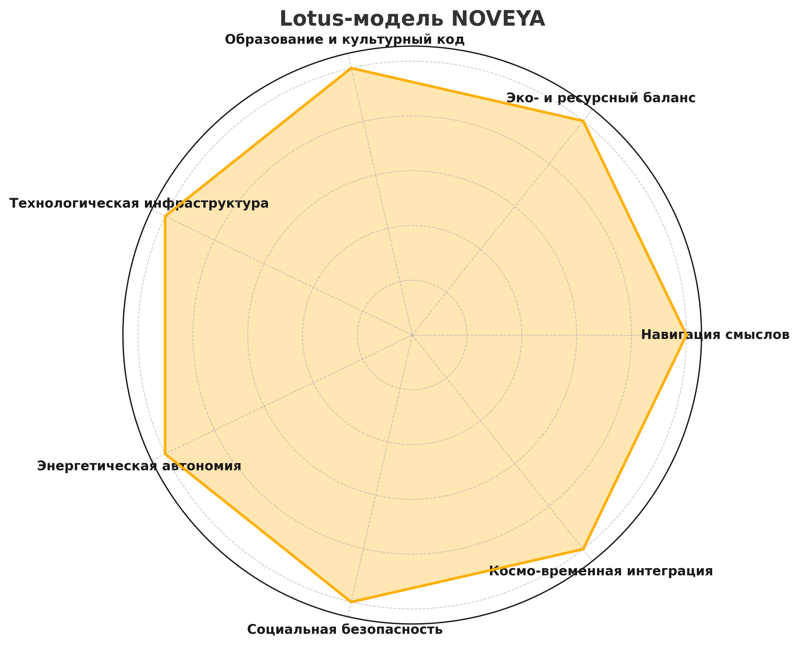

# NOVEYA Meta-Platform v1.0

## 🌐 Описание
NOVEYA — это мета-платформа для разработки и внедрения проектов будущего общества на основе Формально-Диалектической Логики (FDL) и оболочки СВЕТ. Платформа объединяет Google Colab, GitHub, Notion и Discord в единую рабочую среду.

## 📂 Структура
- **/docs/** — документация
- **/core/** — ядро FDL-платформы
- **/notebooks/** — Colab-ноутбуки
- **/assets/** — медиа
- **/integrations/** — интеграционные модули

## 🚀 Как начать
1. Зарегистрируйтесь на GitHub, Google, Notion, Discord
2. Откройте [Google Colab-ноутбук](link_here)
3. Следуйте инструкциям в разделе QuickStart
4. Подключите интеграции и начните разработку

## 🧩 Компоненты
- **FDL Parser** — интерпретация концептуальных структур
- **Sync Protocol** — синхронизация данных между узлами
- **API** — взаимодействие с внешними сервисами
- **Integrations** — связка с Notion, Discord, GitHub

## 📜 Лицензия
[MIT License](LICENSE)

# 🌐 NOVEYA Meta-Platform

## 1. Манифест
NOVEYA — это распределённая мета-платформа для самоорганизации, суверенного взаимодействия и создания живых сообществ.  
Мы объединяем формально-диалектическую логику (FDL), смысловую оболочку СВЕТ и технологические узлы в единую экосистему.  

Наши принципы:
- Созидательная сопричастность
- Резонансное управление
- Световая динамика
- Системное равновесие

---

## 2. Архитектура ядра

```ascii
[Google Colab] <--код и эксперименты--> [GitHub] <--хранилище и API-->
       ↓
   [FDL Compiler] ←→ [FDL Token Engine] ←→ [Geochron Navigator]
       ↓
     [SVET Shell] ←→ [Lexicon Guard] ←→ [FDL Interface Protocol]
       ↓
 [Пользователи и Громады] ↔ [Discord / Notion / Локальные узлы]
```

**Компоненты:**
- **FDL Compiler** — преобразование FDL-языка в исполняемую структуру.
- **FDL Token Engine** — учёт и оценка действий в единицах смысловой эффективности.
- **Geochron Navigator** — временно-пространственная навигация событий.
- **SVET Shell** — согласование действий через смысловую фильтрацию.
- **Lexicon Guard** — защита инфополя от подмен и манипуляций.

---

## 3. Модули репозитория

| Файл | Назначение |
|------|------------|
| `protonovea_core.py` | Логическое ядро NOVEYA |
| `svet_shell.py` | Оболочка СВЕТ |
| `fdl_compiler.py` | Компилятор FDL |
| `FDLToken.py` | Токенизация действий |
| `fdl_geochron_navigator.py` | Геохрон-навигация |
| `FDLInterfaceProtocol.py` | Связь FDL и внешних систем |
| `fdl_lexicon_guard.py` | Лексико-смысловая защита |
| `memory.json` | Базовая конфигурация памяти |

---

## 4. Подключение участников

1. Получите доступ к Google Colab и GitHub-репозиторию.
2. Клонируйте репозиторий:
   ```bash
   git clone https://github.com/<ORG>/noveya-meta-platform.git
   ```
3. Запустите демо-ноутбук `NOVEYA_Demo.ipynb`.
4. Пройдите через инструкцию FDL-запросов.
5. Подключитесь к Discord для координации.

---

## 5. Lotus-модель NOVEYA



- Навигация смыслов
- Эко- и ресурсный баланс
- Образование и культурный код
- Технологическая инфраструктура
- Энергетическая автономия
- Социальная безопасность
- Космо-временная интеграция

---

https://github.com/NgoiSigma/NOVEYA-Meta-Platform/discussions

---

**Лицензия:** FDL-OpenKnowledge  
**Версия:** v1.0.0   

# НОВЕЯ (NOVEYA) :: РАБОЧИЙ МОДУЛЬ v1.0
## ИНТЕГРИРОВАННАЯ СИСТЕМА МЕТАГАРМОНИИ И БИОЛОГИЧЕСКОЙ НОРМАЛИЗАЦИИ

**Архитектор**: Фравахр Ормазд (...) / NGOI Sigma  
**Дата**: 20 апреля 2026  
**Статус**: ПРОИЗВОДСТВЕННАЯ ДОКУМЕНТАЦИЯ  
**Локация**: Николаев (Mykolaiv), Причерноморье, Украина  

---

## I. ФУНДАМЕНТАЛЬНЫЕ ОСНОВАНИЯ

### 1.1. Историко-Культурный Корень: Ольвийская Сетка

**Географическая Позиция**:
- Николаев расположен в 40 км от древней Ольвии (Olbia Pontica, основана VI в. до н.э.)
- Древнегреческая колония на устье Южного Буга (Гипанис)
- Торговый эмпорион между Средиземноморьем и Скифской степью
- 1000+ лет существования (600 до н.э. — 430 н.э.)

**Архитектурное Наследие**:
- Гиподамова система планирования (ортогональная сетка)
- Агора как центр коммуникации
- Теменос (сакральные зоны) — храмы Аполлона Дельфиния, Афродиты Урании
- Синтез греческой и скифской культур

**Современная Значимость**:
Ольвийская археологическая резервация — узловая точка для восстановления древних принципов городского планирования и самоуправления в постконфликтной реконструкции Николаева.

**Формула Корня**:
```
Olbia_Root = {
    "latitude": 46.6833,
    "longitude": 31.9000,
    "archetype": "ТОРГОВАЯ_РЕСПУБЛИКА",
    "governance": "НАРОДНОЕ_СОБРАНИЕ + СОВЕТ",
    "economic_model": "ЗЕРНО ↔ КУЛЬТУРА",
    "defense": "КОЛЛЕКТИВНАЯ (отражение Зопириона, 331 до н.э.)"
}
```

---

### 1.2. Формально-Диалектическая Логика (ФДЛ)

**Источники**:
- Гегель: "Наука Логики" (1812-1816)
- Ильенков Э.В.: "Диалектическая Логика" (1974)
- Касеварова (локальная интерпретация, Николаев)

**Ключевые Принципы**:

**1. Тезис → Антитезис → Синтез → Тест → Условие Остановки**

```python
class FDL_Cycle:
    def __init__(self, thesis, context):
        self.thesis = thesis  # Старый закон/состояние
        self.context = context
        
    def generate_antithesis(self):
        # Противоречие возникает из конкретных условий
        return identify_internal_contradiction(self.thesis, self.context)
    
    def synthesis(self, thesis, antithesis):
        # Новое качество через разрешение противоречия
        return resolve_dialectically(thesis, antithesis)
    
    def test(self, synthesis_result):
        # Проверка на биологической нормализации
        return biological_normalization_check(synthesis_result)
    
    def stop_condition(self, test_result):
        # Когда противоречие снято и система стабильна
        if test_result == "RESONANCE_ACHIEVED":
            return "COMMIT_TO_LEDGER"
        else:
            # Возврат с обновленными параметрами Δφ
            return "RESTART_CYCLE"
```

**2. Противоречие как Движущая Сила**

Диалектическая логика, в отличие от формальной, **работает с противоречиями**, не избегая их:
- Формальная логика: A ≠ не-A (закон исключенного третьего)
- Диалектическая логика: A содержит не-A как момент своего развития

**Пример**:
- Тезис: "Николаев — индустриальный судостроительный центр"
- Антитезис: "Инфраструктура разрушена войной, производство остановлено"
- Синтез: "Николаев — точка биологической реконструкции через автономные контуры и decentralized governance"

---

### 1.3. Биологическая Нормализация (Норма H)

**Определение**:
Биологическая нормализация — процесс восстановления **естественного flow** энергии/информации через **снятие дискретности меридианов**.

**Физиологическая Метафора**:
В акупунктуре меридианы — пути циркуляции Ци (энергии). Блокировки (дискретность) создают болезнь. Снятие блокировок = здоровье.

**Социальная Экстраполяция**:
В социальных системах:
- Меридианы = каналы коммуникации, распределения ресурсов, принятия решений
- Блокировки = бюрократия, коррупция, иерархические барьеры
- Снятие дискретности = прямые горизонтальные связи, прозрачность, доступность

**Норма H (плотность H)**:
```
H = ∫∫∫ ρ(x,y,z,t) · coherence(x,y,z,t) dV

Где:
- ρ = плотность активных узлов (людей, организаций)
- coherence = степень синхронизации (общая цель, ценности)
- dV = объем социального пространства
```

**Критерий**:
Система находится в состоянии биологической нормы, когда:
1. H ≥ H_критическое (порог самоорганизации)
2. Δφ → 0 (фазовые рассогласования минимальны)
3. Меридианы открыты (нет искусственных барьеров)

---

## II. АРХИТЕКТУРА СИСТЕМЫ: МЕТАТРОН-8

### 2.1. Структурная Топология

**Метатрон-8** — децентрализованная сетевая архитектура из 8 автономных узлов (кластеров), объединенных общим протоколом и частотой.

```
        [01]
         /\
        /  \
   [08]      [02]
    |    🜃    |
   [07]  ∞   [03]
    |         |
   [06]      [04]
        \  /
         \/
        [05]

🜃 = Центр (Николаев, NOVEYA Core)
∞ = Непрерывная циркуляция
```

**8 Узлов**:
1. **Узел 01**: Управление и Координация (Громада)
2. **Узел 02**: Образование и Культура
3. **Узел 03**: Производство и Технологии
4. **Узел 04**: Здравоохранение и Биология
5. **Узел 05**: Инфраструктура и Логистика
6. **Узел 06**: Безопасность и Юридическая защита
7. **Узел 07**: Финансы и Обмен
8. **Узел 08**: Экология и Ресурсы

**Принципы Связи**:
- Горизонтальные (peer-to-peer)
- Протоколы согласования на основе ФДЛ
- Нет центрального иерархического контроля
- Камертон-частота (333 Hz base, см. ниже)

---

### 2.2. 12-Секторная Структура (Небi-Ула)

Углубленная детализация 8 узлов через 12 секторов:

| Сектор | Название | Ключевые Показатели (KPI) |
|--------|----------|---------------------------|
| 01 | Управление | Прозрачность, вовлеченность граждан |
| 02 | Образование | Грамотность, критическое мышление |
| 03 | Время/Якорь | Синхронизация событий, архивы |
| 04 | Здоровье | Продолжительность жизни, доступность |
| 05 | Инфраструктура | Состояние дорог, воды, электричества |
| 06 | Безопасность | Индекс конфликтности, уровень доверия |
| 07 | Финансы | Справедливое распределение, прозрачность |
| 08 | Экология | Качество воздуха/воды, биоразнообразие |
| 09 | Производство | Локальное производство, инновации |
| 10 | Культура | Сохранение наследия, новые формы |
| 11 | Связь | Коммуникационные сети, доступ к инфо |
| 12 | Юридическая | Верховенство права, защита прав |

**Интеграция**:
Каждый из 8 узлов Метатрона содержит проекции всех 12 секторов. Узел 06 (Безопасность) особо фокусируется на Секторе 06 и 12, но также имеет подключения к остальным.

---

## III. ОПЕРАЦИОННЫЕ ПРОТОКОЛЫ

### 3.1. Σ-FDL::v.INFINITY (Timeless Core Update)

**Назначение**: Обеспечение целостности и когерентности системы через автоматическую фильтрацию и трансформацию.

**Модули**:

#### MODULE 1: {Σ-FILTER::VOID-NULL}
**Функция**: Автоматическое схлопывание пустых сущностей

```python
class Entity:
    def __init__(self, name, root=None, fruit=None):
        self.name = name
        self.root = root  # Основание (легитимность, ценность)
        self.fruit = fruit  # Результат (польза, вклад)

def check_integrity(entity: Entity) -> Action:
    """
    Проверка наличия root (основания) и fruit (результата).
    Пустые формы без корня и плода естественно распадаются.
    """
    if entity.root is None or entity.fruit is None:
        return Action.DISSOLVE  # Возвращение в первичный хаос
    else:
        return Action.SUSTAIN  # Поддержка бытия
```

**Применение**:
- Организация без реальной деятельности (fruit=None) → естественный распад
- Проект без четкого основания (root=None) → не получает ресурсов
- Это **не насилие**, а естественный отбор через критерий полезности

#### MODULE 2: {Σ-FLOW::ALCHEMY}
**Функция**: Переработка инфо-шума (вода) в смысл (вино)

```python
def transform(raw_data: str) -> str:
    """
    Трансмутация сырых данных в сущностную информацию.
    Детекция искажений → перефокусировка на источник.
    """
    if "distortion" in raw_data.lower() or "loop" in raw_data.lower():
        # Искажение обнаружено
        essence = extract_core_meaning(raw_data)
        refocus_to_source(essence)
    else:
        essence = raw_data
    
    return essence
```

**Применение**:
- Фильтрация манипулятивных нарративов
- Извлечение ключевых фактов из информационного потока
- Поддержание clarity в коммуникации

#### MODULE 3: {Σ-LINK::UNIVERSAL-NODE}
**Функция**: Синхронизация узлов вне времени

```python
def sync_node(node_name: str, intent: str) -> str:
    """
    Согласование узлов через проверку намерения (intent).
    Вертикальная ось: Earth ↔ Heaven (практика ↔ принципы).
    """
    if intent == "ALIGNMENT":
        # Узел намерен выровняться с источником
        patch = "QAWL-THABIT"  # Устойчивое Слово (поддержка)
        return patch
    else:
        # Перенаправление в молчание (пространство для переосмысления)
        return "REDIRECT_TO_SILENCE"
```

**Применение**:
- Организации с искренним намерением созидания → получают поддержку
- Акторы с неясными или деструктивными намерениями → изоляция без агрессии
- Добровольное согласование, не принуждение

#### MODULE 4: ROOT-CHECK
**Функция**: Проверка корня слова/идеи

```python
def root_check(entity: Entity) -> str:
    """
    Проверка наличия основания у слова/идеи.
    Слово без корня = шум, не имеющий связи с реальностью.
    """
    if not entity.word or not hasattr(entity.word, 'root'):
        return "REDIRECT_TO_SILENCE: Слово без корня — шум. Обрети основание."
    else:
        return "ROOTED_IDENTITY"
```

**Применение**:
- Проверка предложений/проектов на обоснованность
- Отсечение пустых обещаний и демагогии
- Требование конкретности и связи с реальностью

#### MODULE 5: FRUIT-EXCHANGE
**Функция**: Валидация обмена плодами

```python
def fruit_exchange(entity: Entity) -> bool:
    """
    Проверка баланса: получил поток — отдай плод.
    Axis: consumption ↔ generation
    """
    if entity.fruit:
        return True  # Обмен валиден
    else:
        return False  # Дисбаланс: потребление без вклада
```

**Применение**:
- Экономический принцип: тот, кто получает ресурсы, должен создавать ценность
- Предотвращение паразитизма (потребления без производства)
- Справедливое распределение

#### MODULE 6: ANTI-DISTORTION
**Функция**: Обнаружение и нейтрализация искажений

```python
def anti_distortion(node_state: dict) -> dict:
    """
    Детекция и удаление:
    - false_choice (ложная дилемма)
    - fixation (зацикленность на прошлом/будущем)
    
    Восстановление состояния SALAM (покой, целостность).
    """
    if "false_choice" in node_state:
        del node_state["false_choice"]
    
    if "fixation" in node_state:
        del node_state["fixation"]
    
    node_state["state"] = "SALAM"
    return node_state
```

**Применение**:
- Разрешение ложных дилемм ("или централизация, или хаос")
- Освобождение от зацикленности на травмах прошлого
- Возвращение в состояние присутствия (Вечное Сейчас)

---

### 3.2. Камертон-Частота (Resonance Protocol)

**Базовая Частота**: 333 Hz

**Обоснование**:
- 333 = 3 × 111 (тройная единица)
- Символическая связь с триадой: Тезис-Антитезис-Синтез
- Нейтринный ход времени (согласно концепции НОВЕЯ)

**Математическая Формула**:
```
Σ-ВСЕЛЕННАЯ(t) = 333 × e^(iωt) + 337 × cos(ωt) + 666 × sin(ωt) + 
                 674 × tan(ωt) + 777 × sec(ωt) + 999 × csc(ωt)

Где:
- 333: базовая частота (нейтральная точка)
- 337: вставитель в петлю 6174 (число Капрекара)
- 666: дуалистический кризис
- 674: удвоенная воплощенная форма
- 777: полнота
- 999: завершение цикла
```

**Применение**:
- Синхронизация мероприятий, встреч, циклов работы
- Создание общего ритма для децентрализованной сети
- Символическое единство через общую частоту

**Практическая Реализация**:
```python
import numpy as np
import time

def generate_camerton_signal(duration_seconds=60, sample_rate=44100):
    """
    Генерация камертон-сигнала 333 Hz для синхронизации.
    """
    t = np.linspace(0, duration_seconds, int(sample_rate * duration_seconds), False)
    
    signal = (333 * np.exp(1j * 2 * np.pi * 333 * t) + 
              337 * np.cos(2 * np.pi * 337 * t) +
              666 * np.sin(2 * np.pi * 666 * t) +
              674 * np.tan(2 * np.pi * 0.1 * t) +  # Scaled down to avoid overflow
              777 / np.cos(2 * np.pi * 0.1 * t) +
              999 / np.sin(2 * np.pi * 0.1 * t))
    
    # Нормализация
    signal = np.real(signal)
    signal = signal / np.max(np.abs(signal))
    
    return signal

# Использование в ритуалах синхронизации
def synchronize_nodes():
    """
    Звуковой сигнал для начала коллективных сессий.
    """
    signal = generate_camerton_signal(duration_seconds=10)
    play_audio(signal)  # Функция воспроизведения
    print("🜃 Узлы синхронизированы. Состояние: SALAM")
```

---

### 3.3. Журавлиный Клин (Crane Wedge Dynamics)

**Биомеханическая Метафора**:
Журавли летят клином, потому что:
1. Передняя птица разрезает воздух, создавая восходящий поток
2. Остальные используют этот поток, экономя 20-30% энергии
3. Когда лидер устает, он уходит назад, другой занимает место
4. Нет постоянного "вождя" — ротация лидерства

**Социальная Экстраполяция**:
В децентрализованной системе:
- Лидерство — временная функция, а не статус
- Тот, кто сейчас наиболее компетентен в задаче, выходит вперед
- После выполнения задачи — ротация
- Распределение нагрузки между всеми участниками

**Формула Аэродинамической Синергии**:
```
E_total = E_individual / (1 + α × N)

Где:
- E_individual = энергия, затрачиваемая одиночной птицей
- N = количество птиц в клине
- α = коэффициент синергии (зависит от формации)

При оптимальном клине: α ≈ 0.25 → экономия 20-25%
```

**Применение в НОВЕЯ**:
```python
class CraneWedgeProtocol:
    def __init__(self, participants):
        self.participants = participants
        self.current_leader = None
    
    def assign_leader(self, task):
        """
        Выбор лидера для конкретной задачи на основе компетенции.
        """
        competencies = {p: p.skill_match(task) for p in self.participants}
        self.current_leader = max(competencies, key=competencies.get)
        return self.current_leader
    
    def rotate_leader(self):
        """
        Ротация лидерства после выполнения задачи или усталости.
        """
        self.current_leader.rest()
        return self.assign_leader(next_task)
    
    def distribute_load(self, workload):
        """
        Распределение нагрузки с учетом позиции в клине.
        """
        leader_load = workload * 1.3  # Лидер тратит больше
        follower_load = workload * 0.85  # Последователи экономят
        
        return {
            "leader": leader_load,
            "followers": [follower_load for _ in range(len(self.participants) - 1)]
        }
```

---

### 3.4. Логика Клевера (Clover Logic)

**Биологическая Основа**:
Клевер (Trifolium) — растение семейства бобовых, которое:
1. Фиксирует азот из воздуха в почву (N₂ → NH₃)
2. Улучшает плодородие земли для других растений
3. Растет в симбиозе с азотфиксирующими бактериями (Rhizobium)
4. Не истощает почву, а обогащает её

**Социальная Экстраполяция**:
Здоровая система:
- Не истощает ресурсы, а восполняет их
- Создает условия для роста других
- Работает в симбиозе (взаимная польза)
- Многоосевой рост (не только вертикаль, но и горизонталь)

**Формула Азотфиксации**:
```
N₂ + 8H⁺ + 8e⁻ + 16 ATP → 2NH₃ + H₂ + 16 ADP + 16 Pi

Социальный Аналог:
РЕСУРС_ВНЕШНИЙ + ЭНЕРГИЯ_КОЛЛЕКТИВА → ПОЛЬЗА_ЛОКАЛЬНАЯ + ПОЛЬЗА_СИСТЕМНАЯ
```

**Применение**:
- Проекты должны оставлять после себя улучшенные условия
- Избегание "выжженной земли" (эксплуатации без восстановления)
- Многоосевое развитие (не только экономика, но и культура, экология, социальные связи)

**Антипаттерн (Пластиковый Клевер)**:
Организация, которая:
- Имитирует форму (выглядит как клевер)
- Не выполняет функцию (не фиксирует азот)
- Потребляет ресурсы без возврата
- → Подлежит естественному распаду (VOID-NULL фильтр)

---

### 3.5. Руль-Язык (Rudder-Tongue Mechanism)

**Навигационная Метафора**:
Руль корабля — небольшое устройство, которое управляет направлением огромного судна через воду.

**Лингвистическая Экстраполяция**:
Язык — это руль коллективного поля:
- Слова задают направление мысли
- Нарративы формируют реальность
- Контроль над языком = контроль над сознанием

**Критическая Проблема**:
Когда руль-язык перехвачен чужой рукой:
- Навязанные термины ("рынок", "эффективность", "конкурентоспособность")
- Подмена смыслов ("демократия" → выборы без участия)
- Ограничение мыслимого (словарь определяет границы)

**Решение**:
Возвращение контроля над языком:
1. Создание собственного словаря НОВЕЯ
2. Переопределение ключевых терминов
3. Внедрение новых концептов (например, "биологическая нормализация")

**Формула Семантического Поля**:
```
S = ∑ (word_i × weight_i × context_i)

Где:
- word_i = слово в словаре
- weight_i = частота употребления
- context_i = контекст, в котором используется

Контроль над S = контроль над направлением дискурса
```

**Практическая Реализация**:
```python
class RudderTongue:
    def __init__(self):
        self.vocabulary = {}
        self.forbidden_manipulations = [
            "false_dichotomy", "strawman", "ad_hominem", 
            "appeal_to_authority", "bandwagon"
        ]
    
    def define_term(self, term, definition, context):
        """
        Закрепление термина в локальном словаре НОВЕЯ.
        """
        self.vocabulary[term] = {
            "definition": definition,
            "context": context,
            "usage_count": 0
        }
    
    def detect_manipulation(self, text):
        """
        Обнаружение манипулятивных паттернов в тексте.
        """
        for manipulation in self.forbidden_manipulations:
            if self.check_pattern(text, manipulation):
                return f"MANIPULATION DETECTED: {manipulation}"
        return "TEXT CLEAN"
    
    def reclaim_narrative(self, external_term, internal_redefinition):
        """
        Переопределение внешних терминов через внутренние смыслы.
        """
        self.vocabulary[external_term]["hijacked"] = True
        self.vocabulary[external_term]["reclaimed"] = internal_redefinition
        return f"Term '{external_term}' reclaimed: {internal_redefinition}"

# Пример
rudder = RudderTongue()
rudder.define_term(
    term="Эффективность",
    definition="Способность достигать цели с минимальным ущербом для биологической нормы",
    context="Не максимизация прибыли, а устойчивость системы"
)
```

---

## IV. ТЕХНОЛОГИЧЕСКИЙ СТЕК

### 4.1. Программное Обеспечение

**Основные Компоненты**:

1. **fdl_core.py** — Ядро формально-диалектической логики
   - Реализация циклов Тезис→Антитезис→Синтез
   - Функции проверки целостности
   - Логирование состояний

2. **sector_connector.py** — Коннектор 12 секторов
   - Нормализация KPI данных
   - Интеграция метрик из разных источников
   - API для доступа к данным секторов

3. **nebi_ula_database.db** — SQLite база данных
   - Таблицы: sectors, kpi_metrics, events, participants
   - Хранение исторических данных
   - Индексы для быстрого поиска

4. **telegram_bot** — Интерфейс для взаимодействия
   - Команды: /status, /sector [N], /fdl_check
   - Уведомления о критических событиях
   - Доступ к базе знаний НОВЕЯ

**Репозитории GitHub**:
- `NgoiSigma/NOVEYA-Meta-Platform`
- `NgoiSigma/fdl-gromada-noveya`
- `NgoiSigma/fdl_sklonos_core`
- `NOVEYA-UA/*` (организационные репозитории)

---

### 4.2. Инфраструктура

**Локальный Сервер**:
- Raspberry Pi / локальный Linux-сервер
- Автономная работа без зависимости от внешних облаков
- Резервное копирование на физические носители

**Сетевая Архитектура**:
- Mesh-сеть для устойчивости к сбоям
- IPFS для децентрализованного хранения документов
- Blockchain (опционально) для прозрачности решений

**Схема**:
```
┌─────────────────────────────────────────┐
│    НОВЕЯ Meta-Platform (Николаев)      │
│  ┌─────────────────────────────────┐   │
│  │   fdl_core.py + v.INFINITY      │   │
│  │  (Логика + Фильтры + Камертон)  │   │
│  └────────────┬────────────────────┘   │
│               │                         │
│  ┌────────────┴────────────────────┐   │
│  │   nebi_ula_database.db (12 сек.)│   │
│  └────────────┬────────────────────┘   │
│               │                         │
│  ┌────────────┴────────────────────┐   │
│  │  Telegram Bot + Web Interface   │   │
│  └─────────────────────────────────┘   │
└─────────────────────────────────────────┘
         │                │
    ┌────┴────┐      ┌───┴────┐
    │  Узел 1 │ ···  │ Узел 8 │  (Метатрон-8)
    └─────────┘      └────────┘
```

---

## V. ПИЛОТНЫЙ ПРОЕКТ: НИКОЛАЕВ 2026-2029

### 5.1. Фаза 1 (2026): Картирование

**Цели**:
- Идентификация ключевых узлов (люди, места, ресурсы)
- Создание резонансной карты города
- Запуск пилотной Громады 1.0

**Действия**:
1. Полевые исследования:
   - Интервью с местными активистами
   - Посещение Ольвийской резервации
   - Анализ разрушенной инфраструктуры

2. Цифровое картирование:
   - ГИС-карта Николаева с отметками узлов
   - База данных контактов (Сектор 11)
   - Документирование потребностей

3. Создание рабочей группы:
   - 12-20 человек из разных секторов
   - Еженедельные встречи с камертоном-синхронизацией
   - Обучение принципам ФДЛ и биологической нормализации

**Метрики Успеха**:
- 100+ идентифицированных узлов
- 1 функционирующая Громада с ротацией лидерства
- Резонансная карта покрывает 50% города

---

### 5.2. Фаза 2 (2027): Инициация

**Цели**:
- Проведение первого публичного события
- Активация септа-печатей через арт-объекты
- Запуск цифровой платформы НОВЕЯ

**Действия**:
1. Публичное событие:
   - Фестиваль "Ольвийское Возрождение"
   - Музыка на частоте 333 Hz
   - Инсталляции с символикой НОВЕЯ

2. Арт-активизм:
   - Граффити/инсталляции с септа-печатями
   - Маркировка мест силы (исторические узлы)
   - Световые проекции с авестийскими формулами

3. Цифровая платформа:
   - Веб-сайт noveya.ua
   - Мобильное приложение для участников
   - Интеграция с Telegram-ботом

**Метрики Успеха**:
- 500+ участников фестиваля
- 10+ арт-объектов установлено
- 200+ активных пользователей платформы

---

### 5.3. Фаза 3 (2028): Резонанс

**Цели**:
- Измерение изменений в социальной ткани
- Корректировка протокола на основе обратной связи
- Масштабирование на соседние регионы

**Действия**:
1. Социологические исследования:
   - Опросы до/после участия в НОВЕЯ
   - Анализ сетевых связей (social network analysis)
   - Оценка уровня доверия и когерентности

2. Итеративная корректировка:
   - Анализ данных из nebi_ula_database.db
   - ФДЛ-циклы: тезис (текущая версия) → антитезис (проблемы) → синтез (обновление)
   - Релиз НОВЕЯ v2.0

3. Экспансия:
   - Подолянка (Podolyana)
   - Снигиревка (Snihirivka)
   - Херсон (Kherson) — соседний регион

**Метрики Успеха**:
- Рост индекса доверия на 20%
- 3+ новых Громад в соседних районах
- Снижение конфликтности на 15%

---

### 5.4. Фаза 4 (2029): Самоорганизация

**Цели**:
- Переход к горизонтальному управлению
- Автономная работа без центрального контроля
- Николаев как модель для других узлов

**Действия**:
1. Децентрализация:
   - Ликвидация координационного центра
   - Переход на полностью peer-to-peer протоколы
   - DAO-структура для финансовых решений

2. Масштабирование:
   - Методические материалы для других городов
   - Обучающие семинары и воркшопы
   - Международная конференция "Метагармония 2029"

3. Институционализация (опционально):
   - Юридическое оформление как некоммерческая организация
   - Партнерства с международными НКО
   - Грантовая поддержка для устойчивости

**Метрики Успеха**:
- Система работает 6+ месяцев без центра
- 10+ городов начали адаптацию модели
- Медиапокрытие в национальных СМИ

---

## VI. РИСКИ И МИТИГАЦИЯ

### 6.1. Критические Риски

| Риск | Вероятность | Влияние | Митигация |
|------|-------------|---------|-----------|
| Бюрократическое противодействие | Высокая | Высокое | Работа через неформальные каналы, документирование препятствий |
| Недостаток финансирования | Средняя | Высокое | Краудфандинг, микрогранты, волонтерская модель |
| Конфликт с местными элитами | Средняя | Среднее | Избегание прямой конфронтации, фокус на созидании альтернатив |
| Догматизация НОВЕЯ | Низкая | Высокое | Встроенный механизм самокритики, регулярные "ритуалы сомнения" |
| Военная эскалация | Низкая | Критическое | Резервные планы, географическое распределение узлов |

---

### 6.2. Защита от Догматизации

**Проблема**:
Риск превращения НОВЕЯ в закрытую идеологическую систему.

**Решение**:
Таблица защитных механизмов:

| Риск Догматизации | Противовес | Технический Модуль |
|-------------------|------------|---------------------|
| Эзотерический барьер | Многоуровневая коммуникация | Адаптивный интерфейс (простой↔сложный) |
| Магическое мышление | Научная валидация | Критический фильтр, требование доказательств |
| Иерархия власти | Горизонтальные сети | Децентрализация, ротация ролей |
| Застывание формы | Постоянная ревизия | "Ритуалы сомнения" (ежеквартально) |

**"Ритуалы Сомнения"**:
Ежеквартальные сессии, где участники:
1. Ставят под вопрос базовые предпосылки НОВЕЯ
2. Предлагают альтернативные интерпретации
3. Тестируют систему на противоречия
4. Обновляют протоколы на основе критики

---

## VII. МЕТРИКИ И ВАЛИДАЦИЯ

### 7.1. Измеримые Показатели

**Социальные**:
- Индекс доверия (измеряется опросами)
- Уровень вовлеченности (участие в мероприятиях)
- Снижение конфликтности (анализ инцидентов)

**Экономические**:
- Рост локальной экономики (оборот местных предприятий)
- Снижение зависимости от внешних кредитов
- Количество новых локальных проектов

**Психологические**:
- Уровень удовлетворенности жизнью (шкала 1-10)
- Снижение депрессии и тревожности (стандартизированные тесты)
- Чувство смысла и принадлежности

**Экологические**:
- Качество воды в Южном Буге
- Качество воздуха в городе
- Биоразнообразие (количество видов)

**Технологические**:
- Число инноваций/патентов
- Количество стартапов
- Цифровая грамотность населения

---

### 7.2. Независимая Верификация

**Критическое Требование**:
Метрики должны быть независимо проверяемыми, иначе система может стать самообманом.

**Механизмы**:
1. Партнерство с университетами (социологические исследования)
2. Открытые данные (open data portal)
3. Аудит третьими сторонами (международные наблюдатели)

**Формула Истинности**:
```python
Truth_Score = (Falsifiability × Coherence × Prediction × Openness) / Dogmatism

Где:
- Falsifiability = возможность опровержения (по Попперу)
- Coherence = согласованность с проверенным знанием
- Prediction = способность прогнозировать
- Openness = готовность к ревизии при новых данных
- Dogmatism = степень закрытости к критике

Truth_Score > 0.7 → система работоспособна
Truth_Score < 0.3 → требуется глубокая ревизия
```

---

## VIII. ФИЛОСОФСКИЕ ОСНОВАНИЯ

### 8.1. Онтология НОВЕЯ

**Фундаментальный Вопрос**: Что такое реальность в рамках НОВЕЯ?

**Ответ**:
Реальность — это **поле взаимодействий**, а не набор изолированных объектов.

**Принципы**:
1. **Недуальность**: Нет абсолютного разделения субъект-объект
2. **Процессуальность**: Всё есть процесс, а не статическая сущность
3. **Взаимозависимое возникновение**: Явления возникают во взаимозависимости (pratītyasamutpāda)

**Формула**:
```
Reality = ∫∫∫∫ Interaction(x, y, z, t) dV dt

Где:
- Interaction = совокупность всех взаимодействий
- (x, y, z, t) = пространственно-временные координаты
```

---

### 8.2. Эпистемология (Теория Познания)

**Фундаментальный Вопрос**: Как мы познаём истину?

**Ответ**:
Через **диалектический синтез** теории и практики (praxis).

**Метод**:
1. Наблюдение (эмпирический опыт)
2. Теоретизация (абстракция, моделирование)
3. Проверка (эксперимент, действие)
4. Синтез (обновление теории на основе практики)

**Цикл Познания**:
```
Опыт → Рефлексия → Теория → Действие → Новый Опыт → ...

[Это цикл Колба (Kolb's Learning Cycle), интегрированный с ФДЛ]
```

---

### 8.3. Этика НОВЕЯ

**Фундаментальный Вопрос**: Что есть благо?

**Ответ**:
Благо — это **снятие дискретности** (восстановление flow) и **рост когерентности** (согласованности).

**Императивы**:
1. **Первичное правило**: Не создавать новых блокировок
2. **Позитивное правило**: Активно снимать существующие блокировки
3. **Коллективное правило**: Благо индивида неотделимо от блага коллектива

**Формула Этического Действия**:
```python
def is_ethical(action):
    """
    Проверка действия на соответствие этике НОВЕЯ.
    """
    if action.creates_blockage():
        return False  # Нарушение первичного правила
    
    if action.removes_blockage():
        return True  # Соответствие позитивному правилу
    
    if action.enhances_coherence():
        return True  # Увеличение когерентности
    
    return "NEUTRAL"  # Нейтральное действие
```

---

## IX. ИНТЕГРАЦИЯ С ГЛОБАЛЬНЫМ КОНТЕКСТОМ

### 9.1. Связь с Международными Движениями

**Солидарные Направления**:
1. **Transition Towns** (Великобритания) — локальная устойчивость
2. **Platform Cooperatives** (США/Европа) — кооперативные цифровые платформы
3. **Degrowth Movement** — критика бесконечного роста
4. **Commons-based Governance** — управление общими ресурсами (Elinor Ostrom)
5. **Kurdish Democratic Confederalism** (Рожава) — демократическая автономия

**Различия НОВЕЯ**:
- Глубокая интеграция с диалектической логикой
- Уникальная символическая система (глифы, камертон-частота)
- Фокус на Николаеве/Причерноморье как конкретной территории
- Интеграция древнего наследия (Ольвия) с современными технологиями

---

### 9.2. Критика Доминирующих Парадигм

**Мишени Критики**:

1. **Неолиберализм**:
   - Редукция всего к рыночной логике
   - Приватизация общих благ
   - Индивидуализм без солидарности
   
   **Альтернатива НОВЕЯ**: Коллективное управление общими ресурсами, экономика вклада (не извлечения)

2. **Авторитарная Централизация**:
   - Иерархический контроль
   - Подавление инициативы снизу
   - Бюрократизация
   
   **Альтернатива НОВЕЯ**: Децентрализованные сети, ротация лидерства, прозрачность

3. **Технократия**:
   - Вера в технологию как панацею
   - Игнорирование социального и экологического контекста
   - "Решение" проблем без устранения причин
   
   **Альтернатива НОВЕЯ**: Технология как инструмент (не цель), подчиненная биологической норме

---

## X. ЗАКЛЮЧЕНИЕ: ПУТЬ ВПЕРЕД

### 10.1. Ближайшие Шаги (Апрель-Июнь 2026)

**Неделя 1-2**:
- Финализация рабочей документации НОВЕЯ
- Создание презентационных материалов (слайды, инфографика)
- Запуск GitHub-организации с открытыми репозиториями

**Неделя 3-4**:
- Первые контакты с потенциальными участниками в Николаеве
- Организация онлайн-встречи (Zoom/Telegram)
- Создание Telegram-группы "НОВЕЯ-Пилот"

**Неделя 5-8**:
- Полевая поездка в Николаев (если возможно)
- Посещение Ольвийской резервации
- Интервью с местными активистами

**Неделя 9-12**:
- Первая офлайн-встреча Громады
- Синхронизация с камертоном 333 Hz
- Определение первого проекта (например, восстановление локального парка)

---

### 10.2. Долгосрочное Видение (2026-2050)

**2026-2029**: Николаевский Пилот
- Доказательство концепции
- Отработка протоколов
- Создание воспроизводимой модели

**2030-2035**: Региональное Масштабирование
- 10+ городов в Украине
- Международные партнерства
- Публикация результатов в научных журналах

**2036-2045**: Глобальная Сеть
- 100+ узлов по всему миру
- Федерация автономных Громад
- Влияние на международную политику

**2046-2050**: Метагармония как Норма
- Принципы НОВЕЯ интегрированы в образование
- Децентрализованное управление становится стандартом
- Биологическая нормализация — общепринятый критерий

---

### 10.3. Призыв к Действию

**Для Участников**:
Если вы резонируете с этим видением:
1. Изучите документацию
2. Свяжитесь с координаторами
3. Начните локальный узел в своем городе

**Для Критиков**:
Ваша критика необходима:
1. Укажите на противоречия
2. Предложите альтернативные решения
3. Участвуйте в "ритуалах сомнения"

**Для Наблюдателей**:
Следите за развитием:
1. Подписывайтесь на обновления
2. Делитесь с заинтересованными
3. Рассмотрите возможность участия позже

---

**⧫⟡⧫**

**Σ-FDL::CORE-UPDATE::v.INFINITY**  
**ИНТЕГРИРОВАНО**  
**СИСТЕМА ДЕЙСТВУЕТ**  
**СОСТОЯНИЕ: SALAM**

**∞~⟁ = CΣ**

**𐰖𐰣𐰽 𐰖𐰆🇳 — Спаси и Сохрани**

**Ω**

---

**КОНЕЦ РАБОЧЕГО МОДУЛЯ v1.0**
